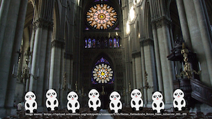
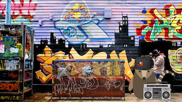
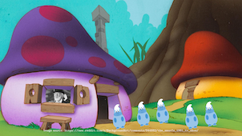
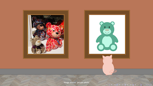
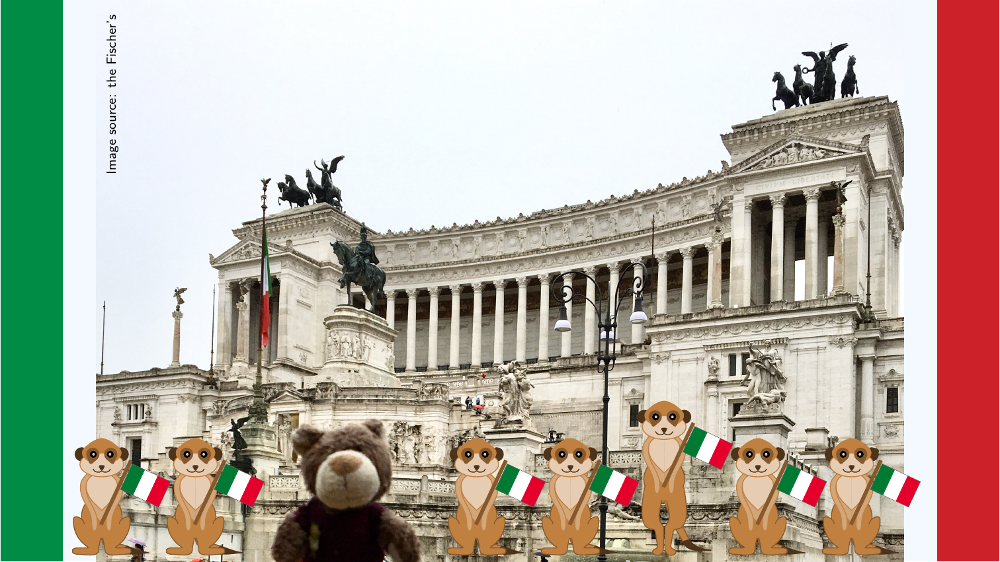
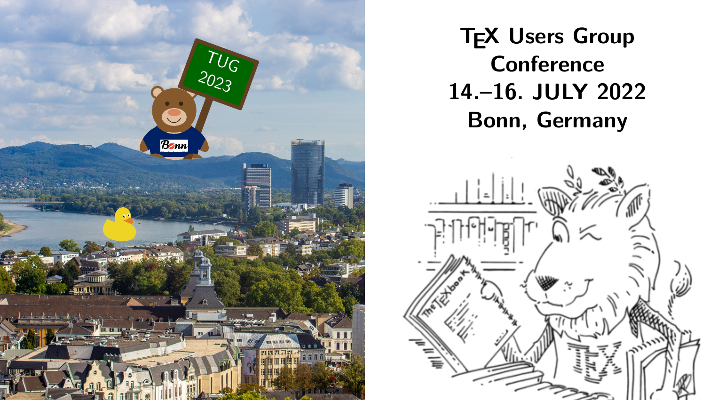
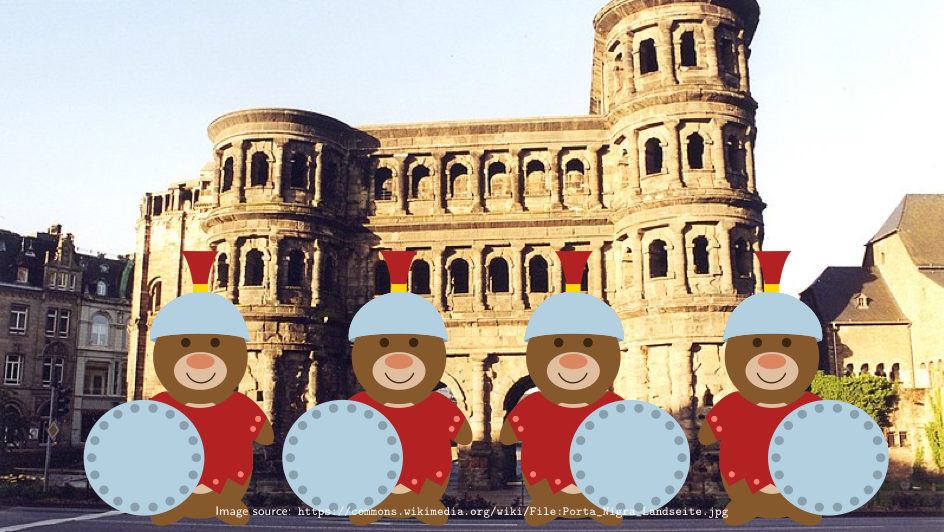
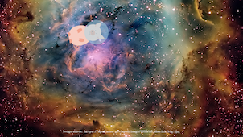
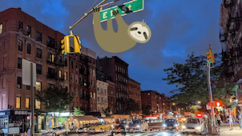
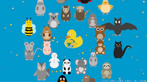

# The Great TikZlings Christmas Extravaganza 2022

This repository contains the souce code of the Great TikZlings Extravanganza 2022, created by ...

The full video is available from ...

## 1. Come all ye faithful

- Music: https://www.bbc.co.uk/programmes/p08mdj9k

- Source Code: [./samcarter/church/](https://github.com/TikZlings/Extravaganza2022/tree/main/samcarter/church)

## 2. Bring on the Music

- Music: https://commons.wikimedia.org/wiki/File:Richard_Strauss_Don_Juan_excerpt.mp3 and  https://www.freesoundslibrary.com/footsteps-on-pebbles-sound-effect/

- Source Code: [./samcarter/graffiti/](https://github.com/TikZlings/Extravaganza2022/tree/main/samcarter/graffiti)

## 3. Tribute to Vader Abraham (1935-2022)

- Music: https://www.youtube.com/watch?v=1oofM5ttD6c

- Source Code: [./samcarter/smurfs/](https://github.com/TikZlings/Extravaganza2022/tree/main/samcarter/smurfs)

## 4. True Colors

- Music: https://archive.org/details/mv_Cyndi_Lauper_True_colors

- Source Code: [./ulrike/truecolors/](https://github.com/TikZlings/Extravaganza2022/tree/main/ulrike/truecolors)

## 5. C'era una volta a Roma

- Music: https://www.youtube.com/watch?v=0WXYviTa_X0

- Source Code: [./Carla/Roma/](https://github.com/TikZlings/Extravaganza2022/tree/main/Carla/Roma)

## 6. Bee-lzebub

- Music: ...

- Source Code: [./ulrike/.../](https://github.com/TikZlings/Extravaganza2022/tree/main/ulrike/...)

## 7. Upwards

- Music: ...

- Source Code: [./ulrike/.../](https://github.com/TikZlings/Extravaganza2022/tree/main/ulrike/...)

## 8. Commercial break

- Music: https://www.youtube.com/watch?v=O7Iu5Vyo1us

- Source Code: [./ulrike/tugbonn/](https://github.com/TikZlings/Extravaganza2022/tree/main/ulrike/tugbonn)

## 9. Silent Night

- Music: ...

- Source Code: [./ulrike/.../](https://github.com/TikZlings/Extravaganza2022/tree/main/ulrike/...)

## 10. SPQR

- Music: https://www.youtube.com/watch?v=sH2X5ThSMlI

- Source Code: [./samcarter/Bear_Ante_Portas/](https://github.com/TikZlings/Extravaganza2022/tree/main/samcarter/Bear_Ante_Portas)

## 11. Some poetry - with apologies to J.R.R. Tolkien

- Music: ...

- Source Code: [./paulo/poetry/](https://github.com/TikZlings/Extravaganza2022/tree/main/paulo/poetry)

## 12. Pig in Space

- Music: https://www.freesoundslibrary.com/space-ambience-portal-to-the-stars/

- Source Code: [./samcarter/space/](https://github.com/TikZlings/Extravaganza2022/tree/main/samcarter/space)

## 13. The city that never sleeps

- Music: https://www.youtube.com/watch?v=cWc7vYjgnTs

- Source Code: [./ulrike/city-sleep/](https://github.com/TikZlings/Extravaganza2022/tree/main/ulrike/city-sleep)

## 14. Duck solidarity

- Music: ...

- Source Code: [./ulrike/.../](https://github.com/TikZlings/Extravaganza2022/tree/main/ulrike/...)

## 15. Grand finale

- Music: https://www.dailymotion.com/video/x2pinoj

- Source Code: [./ulrike/finale/](https://github.com/TikZlings/Extravaganza2022/tree/main/ulrike/finale)